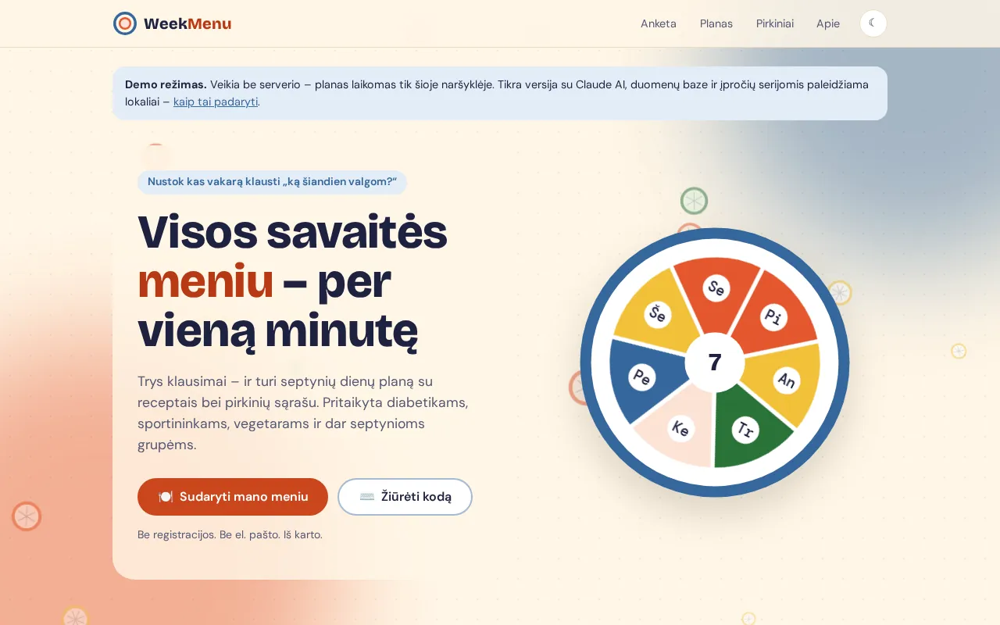
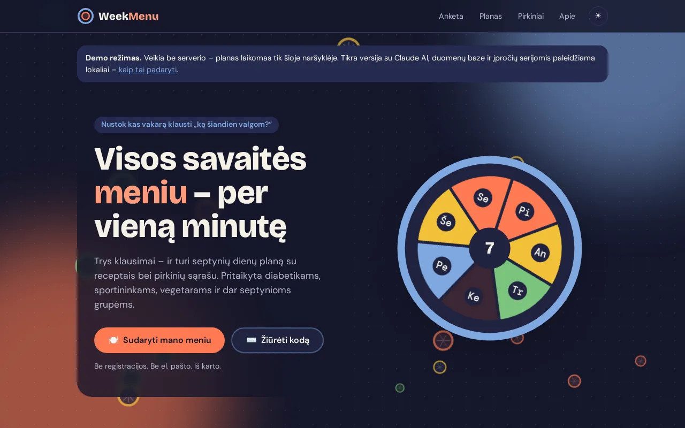
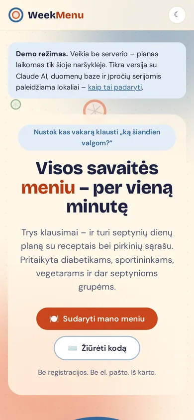

# WeekMenu – AI meal planner

**English** · [Lietuvių](README.lt.md)

Answer three questions and get a whole week's menu with recipes and a ready
shopping list, tailored to ten diets (diabetes, sports, vegetarian and more).

**[▶ Live demo](https://brutall100.github.io/weekmenu-ai-meal-planner/)** ·
**[Source code](https://github.com/brutall100/weekmenu-ai-meal-planner)**



<p>
  
  
</p>

---

## About

Every evening the same question: _"what are we eating today?"_ WeekMenu
answers it once for the whole week. You pick a diet, how many people eat and
how much time you have – and get seven days of meals, a shopping list that
adds up the same ingredients, and a gentle streak that helps you come back.

It is a school project, but built like a real product: layered architecture,
tests, CI, analytics without cookie banners, and written ethics rules
(no dark patterns, no fake reviews).

The interface is in Lithuanian.

## Features

- **Three-step onboarding** – diet, household size and cooking time, meals to plan.
- **Week plan** – no meal twice on the same day, repeats spread as evenly as possible.
- **"Cooked it" and "Another meal"** buttons – one click, instant feedback.
- **Shopping list** – merges the same ingredients, multiplies by portions,
  shows only what is still to cook, remembers ticks on your phone.
- **Claude AI** creates missing recipes and saves them for everyone (runs only when needed).
- **Works without an API key** – AI buttons are disabled with an explanation.
- **Streaks and badges** without guilt-tripping; private funnel dashboard.
- **Live background** – tomato, cucumber and lemon slices float up and spin,
  with a slow parallax; the "week plate" on the home page turns slowly.
- **Light and dark themes** – follows the system, toggle remembered, no flash on load.
- **Accessible** – skip link, visible focus, labels on every field,
  `prefers-reduced-motion` turns animation off, WCAG AA contrast checked.
- **Correct Lithuanian grammar** with numbers: "1 patiekalas", "3 patiekalai", "14 patiekalų".

## Two ways to run it

| | GitHub Pages demo | Full app |
|---|---|---|
| Where | `docs/` – static files | Deno + Fresh server |
| Data | 14 sample meals, saved in your browser (`localStorage`) | Deno KV database |
| AI | – | Claude generates missing recipes |
| Streaks, stories, stats | – | ✓ |
| Planning and shopping logic | **the same code** (`backend/services/arrange.ts`, `shopping.ts`) | ✓ |

GitHub Pages cannot run a server, so the demo is bundled from the same
planning code into `docs/js/demo.js`.

## Built with

- [Deno 2](https://deno.com) + [Fresh 2](https://fresh.deno.dev) + Preact (server-side rendering, islands)
- Deno KV – built-in key–value database
- [Claude API](https://docs.anthropic.com) (`@anthropic-ai/sdk`) + zod schemas
- Tailwind CSS 4 – every colour is a design token in one file
- GitHub Actions – format, lint, type check, tests, build

**Design direction – "Colourful plate"**

| Token | Light | Dark | Used for |
|---|---|---|---|
| `surface` | `#FFF6E6` | `#15172B` | page background |
| `surface-raised` | `#FFFFFF` | `#20233F` | cards |
| `ink` | `#1F2240` | `#F5F1E6` | text |
| `brand` (tomato) | `#E4572E` | `#FF7A52` | accents, glow, slices |
| `action` | `#C9461D` | `#FF7A52` | main buttons (darker tomato for 4.8:1 contrast) |
| `plate` (plate blue) | `#35679C` | `#7FA7E0` | secondary buttons, links, focus ring |
| `butter` | `#F3C13A` | `#F3C13A` | decoration only |
| `fresh` | `#2A7238` | `#7BC47F` | success only: progress, done |

Fonts: **Bricolage Grotesque** (headings), **DM Sans** (text), **DM Mono**
(numbers) from Google Fonts.

## What I learned

- Moving from three repositories (React + Express + MongoDB) to one Deno monorepo.
- Keeping layers honest: pages never touch the database; islands never import the AI client.
- Calling an LLM only when data is missing and caching the result for everyone.
- Sharing one piece of logic between a server app and a static demo.
- Designing habits ethically – streaks without shame, no fake social proof.
- Checking colour contrast with numbers instead of by eye.
- Lithuanian plural rules are harder than they look.

## Run it locally

You need [Deno](https://deno.com) 2.x.

```bash
git clone https://github.com/brutall100/weekmenu-ai-meal-planner.git
cd weekmenu-ai-meal-planner

cp .env.example .env     # then fill in the values (all optional)
deno install             # dependencies
deno task seed           # sample categories and meals
deno task dev            # http://localhost:5173
```

What to put in `.env`:

| Variable | What it is | Needed? |
|---|---|---|
| `ANTHROPIC_API_KEY` | Claude API key from [console.anthropic.com](https://console.anthropic.com) | No – without it AI buttons are disabled |
| `WEEKMENU_AI_MODEL` | Which Claude model generates recipes | No |
| `WEEKMENU_KV_PATH` | Where the local database file lives | No |
| `WEEKMENU_STATS_TOKEN` | Secret for the private `/statistika` dashboard | No – without it the page is 404 |

Other commands:

```bash
deno task generate   # generate meals with Claude (8 per category)
deno task test       # 33 tests
deno task check      # format + lint + types
deno task build      # production build into _fresh/
deno task start      # run the production build
deno task demo       # rebuild the GitHub Pages demo in docs/
```

**Demo only:** open `docs/` with any static server, e.g.
`cd docs && python3 -m http.server`, then visit http://localhost:8000.

Deploying the full app for free on Deno Deploy: see
[`docs/DIEGIMAS.md`](docs/DIEGIMAS.md) (Lithuanian).

## Project structure

```
.
├── shared/            # types, categories, Lithuanian plurals and units
├── backend/
│   ├── db/            # Deno KV: keys, repositories, seed data
│   ├── ai/            # Claude client, prompts, zod schemas
│   ├── services/      # planning (arrange.ts), shopping, session, habits
│   └── lib/           # ids, dates, errors
├── frontend/
│   ├── routes/        # pages + API routes
│   ├── islands/       # interactive components
│   ├── components/    # server-rendered components
│   ├── assets/        # design tokens (styles.css) and effects (efektai.css)
│   └── static/        # theme, live background, micro-effects, favicon
├── scripts/
│   └── demo/          # GitHub Pages demo app (bundled into docs/js/)
├── docs/              # GitHub Pages demo + architecture docs (Lithuanian)
├── tests/             # 33 tests
└── .claude/           # project skills and agents
```

## Credits

- Recipes in the seed data and all code – written for this project.
- AI recipe generation – [Claude](https://www.anthropic.com/claude) by Anthropic.
- Fonts – [Bricolage Grotesque](https://fonts.google.com/specimen/Bricolage+Grotesque),
  [DM Sans](https://fonts.google.com/specimen/DM+Sans),
  [DM Mono](https://fonts.google.com/specimen/DM+Mono) (SIL Open Font License).
- Recipes are not medical advice – consult a doctor or dietitian if you are ill.

## License

[MIT](LICENSE) © 2026 brutall100
